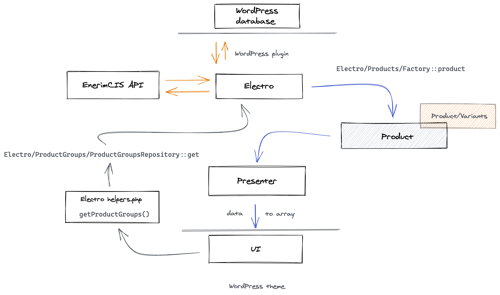

# Getting started

Requirements:

- `"php": "^7.3"`

Dependencies:

- `"nesbot/carbon": "^2.0"` - [documentation](https://carbon.nesbot.com/),
- `"tightenco/collect": "^6.0"` - [documentation](https://laravel.com/docs/7.x/collections)

Required environment variables:

* `ENERIM_API_BASE_URL` EnermiCIS API base URI
* `ENERIM_API_KEY` EnermiCIS API key (GUID) 
* `ENERIM_API_PARTY_ID` EnermiCIS API default partyId 

## Development

Run `composer install` in the project's root directory and activate plugin in
WordPress.

## Deployment

Run `composer install` in the project's root directory during the deployment 
pipeline.

## Basic data flow

